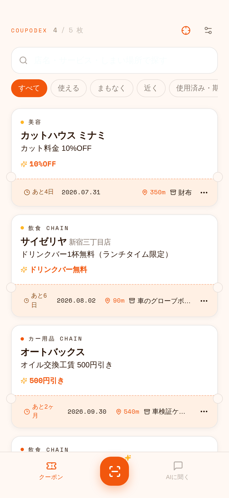
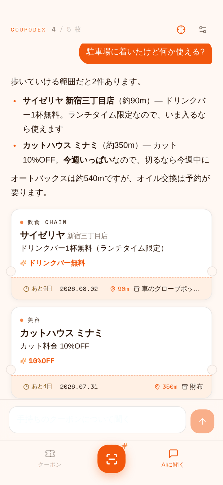

<div align="center">


# Coupodex

紙のクーポンを撮影して管理する Android アプリ

読み取りと検索は、利用者自身の ChatGPT サブスクリプション枠（Codex）を使って端末内で完結します。
専用のサーバーもAPIキーも必要ありません。

[](LICENSE)


**[配布ページ](https://mokouliszt.github.io/Coupodex/)** ・ [ダウンロード](https://github.com/mokouliszt/Coupodex/releases/latest)

</div>

---

Coupodex は、財布やグローブボックスに溜まった紙のクーポンをカメラで取り込み、
期限切れの前に使い切るための Android アプリです。

券面を撮影すると、店舗名・サービス内容・管理場所・使用期限・メモの5項目を読み取って一覧に登録します。
登録したクーポンは、キーワードやあいまい検索のほか、
「駐車場に着いたけど何か使える?」のような自然文でも検索できます。

## 画面

| クーポン一覧 | 取り込み | AI検索 | 操作メニュー |
|:---:|:---:|:---:|:---:|
|  |  |  |  |

## 機能

### 読み取り

券面を1枚撮影すると、Codex が画像を解析して各項目を構造化します。上記の5項目に加えて、
カテゴリ・割引の要点・利用条件・クーポンコード・店舗住所・緯度経度を取得します。
チェーン店と判断できた場合は、web 検索で公式の住所と座標を補完します。

- 「発行日から3ヶ月」「◯月末日まで」のような相対表記は日付に正規化し、券面の原文も保持します
- 読み取りの確度が低いフィールドには「要確認」が付き、確認が必要な場合のみ質問が1つ表示されます
- 保存後もすべての項目を編集できます

読み取れなかった項目を推測で補完することはありません。空欄のまま登録されます。

### 検索

| 検索方法 | 内容 |
| --- | --- |
| キーワード検索 | 店名・サービス・管理場所を横断して検索。スペース区切りでAND |
| あいまい検索 | 全半角・カタカナ/ひらがな・打ち間違いを吸収（NFKC正規化 + 2-gram Dice係数 + 部分列一致） |
| AI検索 | 登録済みの全件と現在地を渡した上での対話。該当するクーポンはカード形式で表示 |
| 絞り込み | 使える / まもなく / 近く（現在地からの半径） / 使用済み・期限切れ |

「昼メシを安くしたい」のような曖昧な指定でも、候補を絞りすぎずに2〜4件を返します。
券面に記載のない営業時間や臨時休業は、必要に応じて web 検索で補います。

### 一覧と操作

- 使用期限が近い順に並びます。使用済み・期限切れのものは彩度を落として末尾に表示します
- カードの長押し、または半券部分の ⋯ から、使用済み・編集・地図・共有・削除を実行できます
- 削除は確認ダイアログなしで実行され、5秒間だけ取り消せます。取り消すと写真を含めて復元されます
- 「近く」の判定半径は 200m〜3km の範囲で設定できます。既定値は 500m です

## 動作環境

- Android 8.0 (API 26) 以上
- ChatGPT の有効なサブスクリプション（Plus / Pro / Business など、Codex が利用できるもの）

APIキーには対応していません。初回にアプリ内から ChatGPT にログインすると、
以降はそのサブスクリプション枠で読み取りと検索が実行されます。

## インストール

### APK からインストールする

[Releases](../../releases) から APK をダウンロードして端末にインストールしてください。
事前に「提供元不明のアプリ」のインストールを許可しておく必要があります。

### ソースからビルドする

```bash
git clone https://github.com/mokouliszt/Coupodex.git

# 1. Web UI をビルドして app/src/main/assets/webui へ出力する
cd webui && npm ci && npm run build && cd ..

# 2. APK をビルドする
./gradlew assembleRelease     # 署名なしなら assembleDebug でも可
```

Web UI のビルド成果物はリポジトリに含まれていません。**手順 1 を省略すると空の WebView が起動します。**

署名する場合は、`keystore.properties.example` を `keystore.properties` にコピーして書き換えるか、
環境変数 `COUPODEX_KEYSTORE` / `COUPODEX_STORE_PW` / `COUPODEX_KEY_ALIAS` / `COUPODEX_KEY_PW`
を設定してください。いずれも指定がない場合は未署名でビルドされます。
`keystore.properties` と `*.jks` は `.gitignore` に登録済みです。

## 配布ページ

`site/` に置いた React + Tailwind のランディングページを、GitHub Actions で GitHub Pages に
デプロイしています（`.github/workflows/pages.yml`）。
`main` の `site/` または `docs/` に変更が入ると自動でビルドされます。

```bash
cd site
npm ci
npm run dev      # ローカル確認
npm run build    # site/dist に出力
```

スクリーンショットは `docs/` のものを `site/public/` へ複製して使っています
（`site/scripts/sync-assets.mjs`）。README とページで素材を二重管理しないためです。

## 構成

```
app/src/main/java/dev/mokouliszt/coupodex/
  CodexAuth.kt       ChatGPT の OAuth（PKCE + localhost:1455 ループバック）
  CodexClient.kt     Codex backend を直接叩く。web検索ON / shell を full-auto サンドボックスで実行
  Net.kt             システムDNS → Cloudflare DoH フォールバック
  Prompts.kt         券面抽出のJSONスキーマ指示、会話検索の指示
  Store.kt           coupons.json と写真の永続化、設定
  Media.kt           Exif回転補正・長辺1600px正規化、LocationManager 測位
  MainActivity.kt    全画面WebView、JSブリッジ、カメラ/ギャラリー/位置
  RequestService.kt  実行中だけ立てる前面サービス

webui/src/
  App.tsx                  ログイン判定、一覧、検索、削除の取り消し
  components/ScanFlow.tsx  撮影 → 解析演出 → 確認・編集
  components/ChatPanel.tsx 会話検索
  components/Markdown.tsx  react-markdown + remark-gfm
  lib/search.ts            日本語向けの正規化とあいまい一致、距離・期限の計算
  lib/viewport.ts          キーボード対応
```

UI は React + Tailwind + shadcn/ui 由来のコンポーネントで構成し、Vite で
`app/src/main/assets/webui` に出力します。WebView へは `WebViewAssetLoader` 経由で
`https://appassets.androidplatform.net/` 配下から配信します（`file://` のオリジン制約を避けるため）。
保存した写真も同じ仕組みで `photos/` 以下から読み込みます。

Android 上で Codex を動作させる部分（PKCE ループバック認証、Responses API の直接呼び出し、
web検索の常時有効化、shell ツールの full-auto サンドボックス実行）は、
同作者の **[overlay-ai](https://github.com/mokouliszt/overlay-ai)** の実装を流用しています。

## データの扱い

- クーポン・写真・設定は端末内（`filesDir`）にのみ保存されます。外部への同期は行いません
- 端末外に送信されるのは、解析・検索のリクエストに含まれる券面の画像とクーポンのテキスト、
  および現在地を許可した場合の緯度経度です。送信先はログイン済みの ChatGPT アカウントのみです
- アンインストールするとデータも削除されます。バックアップ機能はありません
- 位置情報は Play Services に依存せず `LocationManager` のみで取得し、端末には保存しません

## 制限事項

本アプリは公開されていない API を直接利用しています。ChatGPT の Codex backend
(`chatgpt.com/backend-api/codex/responses`) に直接リクエストを送信するため、
OpenAI 側の仕様変更により動作しなくなる場合があります。
利用にあたっては OpenAI の利用規約を各自で確認してください。

## English

Coupodex is an Android app for managing paper coupons. Photograph a coupon and it extracts the
store, the offer, where you stored it, the expiry date and any notes, then lets you search by
keyword, fuzzily, or in natural language ("anything I can use around here?"). All parsing and
search run through your own ChatGPT subscription (Codex OAuth) directly from the device: no
server and no API key are required. Coupon data and photos never leave the phone except as part
of those requests.

The UI is Japanese only. Requires Android 8.0+ and an active ChatGPT subscription.

## ライセンス

[MIT](LICENSE) / Copyright (c) 2026 mokouliszt
